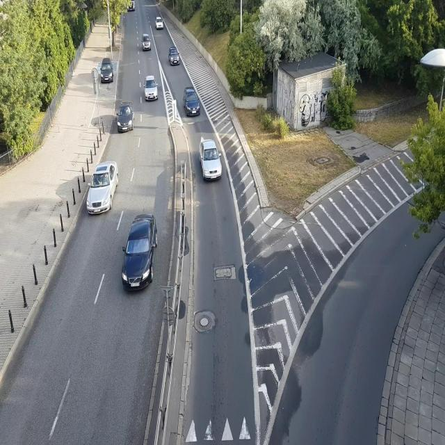

# Smart Parking - Training & Evaluation

Research and development project for vehicle detection, license plate recognition, and vehicle re-identification system for smart parking applications. The project includes training and evaluation of multiple state-of-the-art deep learning models.

## 📋 Table of Contents

- [Overview](#overview)
- [Datasets](#datasets)
- [Data Augmentation](#data-augmentation)
- [Model Training](#model-training)
- [Model Evaluation](#model-evaluation)
- [Installation](#installation)
- [Results](#results)
- [Project Structure](#project-structure)

## 🎯 Overview

The Smart Parking System is developed with 3 main modules:

1. **Vehicle Detection**: Detect vehicles in images/videos
2. **License Plate Recognition**: Recognize license plate numbers
3. **Vehicle Re-identification**: Re-identify vehicles across different cameras

### Implemented Models

#### Detection Models:
- **YOLOv5n**: Lightweight version of YOLO v5 for real-time detection
- **YOLOv8n**: YOLO v8 nano - improved speed and accuracy
- **YOLOv11n**: Latest YOLO version with optimized architecture
- **Faster R-CNN**: Two-stage detector with ResNet50-FPN backbone
- **DETR**: Detection Transformer using attention mechanism

#### Classification Models:
- **YOLOv11n-cls + Cross Entropy**: Basic vehicle classification
- **YOLOv11n-cls + Triplet Loss**: Vehicle Re-ID with metric learning

#### Recognition Models:
- **License Plate Detection + OCR**: YOLOv5 for detection and OCR

## 📊 Datasets

### 1. License Plate Detection Dataset
- **Description**: Dataset for Vietnamese license plate detection
- **Structure**: 
  - `images/`: Original images (train/val/test)
  - `labels/`: YOLO format annotations (txt files)
- **Features**:
  - Multiple brightness conditions
  - Various border types
  - Long and short plate formats


### 2. Mini Car Detect Dataset
- **Source**: Roboflow (CC BY 4.0)
- **Workspace**: khangsworkspace/detect-car-mini-2
- **Version**: 6
- **Classes**: 1 (car)
- **Format**: YOLO v11
- **Splits**: train/valid/test
- **Purpose**: Miniature car detection for toy/model car scenarios


### 3. Real Car Detect Dataset
- **Source**: Roboflow (CC BY 4.0)
- **Workspace**: khangsworkspace/detect-real-cars
- **Version**: 9
- **Classes**: 1 (car)
- **Format**: YOLO v11
- **Purpose**: Real-world vehicle detection in parking environments



### 4. VeRi (Vehicle Re-identification)
- **Source**: VeRi Dataset (Research Only)
- **Description**: Large-scale vehicle re-identification dataset
- **Statistics**:
  - 776 annotated vehicles (576 training, 200 testing)
  - 37,778 training images
  - 11,579 testing images
  - 1,678 query images
  - 20 cameras in real-world traffic surveillance
- **Annotations**:
  - Vehicle ID, Camera ID, Color, Type
  - Ground truth and junk images
  - Camera distances
- **Citation**: Liu et al., IEEE ICME 2016


## 🔄 Data Augmentation

To improve model robustness and generalization, the following augmentation techniques are applied during training:

| Augmentation | Parameters | Purpose |
|-------------|------------|---------|
| **Horizontal Flip** | 50% probability | Handle different vehicle orientations |
| **Vertical Flip** | Applied selectively | Increase data diversity |
| **90° Rotation** | Random | Handle different camera angles |
| **Crop/Zoom** | 0% to 20% | Simulate different distances |
| **Rotation** | -15° to +15° | Handle camera tilt variations |
| **Brightness** | ±20% | Adapt to different lighting conditions |
| **Blur** | Up to 2.5px | Simulate motion blur and camera quality |
| **Noise** | Up to 1.8% pixels | Handle sensor noise |

### Implementation:
- **YOLO models**: Built-in augmentation pipeline
- **DETR**: Albumentations library
- **Faster R-CNN**: Custom transforms with torchvision

## 🚀 Model Training

### 1. YOLO Models Training ([yolo11n_training.ipynb](model_training/yolo11n_training.ipynb))

**Model**: YOLOv11n for car detection

**Training Configuration**:
```python
epochs = 100
batch_size = 16
image_size = 640
patience = 20  # Early stopping
optimizer = 'auto'
```

**Dataset**: Real Car Detect Dataset

**Features**:
- Data visualization with bounding boxes
- Automatic augmentation from YOLO
- Training with pretrained weights (`yolo11n.pt`)
- Real-time monitoring and logging
- Automatic model checkpointing

### 2. YOLOv5 & YOLOv8 Training ([yolov5_8_training.ipynb](model_training/yolov5_8_training.ipynb))

**Comparing two models**:
- YOLOv5n: Baseline model
- YOLOv8n: Improved architecture with better feature extraction

**Configuration**:
```python
epochs = 50
batch_size = 16
image_size = 640
patience = 20
```

**Key Differences**:
- YOLOv8n: Enhanced C2f modules
- Anchor-free detection head
- Improved loss function

### 3. Faster R-CNN Training ([Faster_RCNN.ipynb](model_training/Faster_RCNN.ipynb))

**Architecture**: 
- Backbone: ResNet50-FPN (pretrained on COCO)
- Two-stage detector (RPN + ROI Head)

**Dataset Processing**:
- Convert YOLO format → xyxy format
- Handle empty annotations gracefully
- Custom PyTorch Dataset class
- Dynamic resizing

**Features**:
- Transfer learning from torchvision
- Custom head for 2 classes (background + car)
- IoU-based evaluation metrics
- Adaptive learning rate scheduling

### 4. DETR Training ([DETR.ipynb](model_training/DETR.ipynb))

**Architecture**: Detection Transformer (End-to-End Object Detection)

**Dataset Augmentation** (Albumentations):
```python
- HorizontalFlip (p=0.5)
- RandomBrightnessContrast (brightness=0.2, contrast=0.2, p=0.3)
- ColorJitter (brightness=0.2, saturation=0.2, hue=0.1, p=0.3)
```

**Processing Pipeline**:
- Convert YOLO format → COCO format
- Using HuggingFace Transformers library
- Comparing 5 detection models**:

| Model | Framework | Conf Threshold | Type |
|-------|-----------|----------------|------|
| YOLOv5n | Ultralytics | 0.5 | One-stage |
| YOLOv8n | Ultralytics | 0.5 | One-stage |
| YOLOv11n | Ultralytics | 0.5 | One-stage |
| Faster R-CNN | PyTorch | 0.6 | Two-stage |
| DETR | Transformers | 0.8 | Transformer |

**Evaluation Metrics**:
- mAP@0.5, mAP@0.5:0.95
- Precision, Recall, F1-Score
- Inference time (FPS)
- Per-class metrics
- Throughput analysis

**Outputs**:
- Visualizations with bounding boxes
- Metrics comparison charts
- Video inference results
- JSON results export
- Comprehensive comparison report
- Performance benchmarking

### 2. Mini Car Evaluation ([mini_car_eval.ipynb](model_evaluate/mini_car_eval.ipynb))

**Model**: YOLOv11n on Mini Car Dataset

**Evaluation Features**:
- Detailed Precision-Recall curves
- Confusion matrix visualization
- F1-score curves at different thresholds
- Per-class performance metrics
- Metrics summary visualization

**Validation Settings**:
```python
conf = 0.001  # Low threshold for comprehensive evaluation
iou = 0.5     # Standard COCO metric
save_json = True
plots = True
```

**Analysis**:
- Class-wise average precision
- Detection confidence distribution
- Error analysis

### 3. License Plate Recognition ([LP_recognition.ipynb](model_evaluate/LP_recognition.ipynb))

**Two-Stage Pipeline**:
1. **Detection Stage**: YOLOv5 model detects license plate location
2. **OCR Stage**: YOLOv5 model recognizes characters

**Features**:
- Image deskewing and preprocessing
- Multiple orientation attempts (rotate & flip)
- Confidence threshold: 0.60
- Handling unknown/unreadable plates
- Batch processing capability

**Processing Steps**:
1. Detect bounding box
2. Crop plate region
3. Apply deskew transformations
4. Run OCR with multiple attempts
5. Return best recognition result

**Output**: Set of recognized license plate numbers

### 4. Vehicle Re-ID with Cross Entropy ([yolo11n_cls_CrossEntropy.ipynb](model_evaluate/yolo11n_cls_CrossEntropy.ipynb))

**Dataset**: VeRi Vehicle Re-identification

**Data Processing**:
- Convert VeRi → YOLO classification format
- Train/Val split: 80/20
- Filter vehicles with >= 2 images
- Organize by vehicle ID folders

**Model**: YOLOv11n-cls pretrained

**Task**: Multi-class classification for vehicle IDs

**Approach**: Standard classification with cross-entropy loss

### 5. Vehicle Re-ID with Triplet Loss ([yolo11n-cls-triploss.ipynb](model_evaluate/yolo11n-cls-triploss.ipynb))

**Architecture**:
```python
YOLOv11n backbone (first 6 blocks frozen)
    ↓
AdaptiveAvgPool2d (global average pooling)
    ↓
Flatten
    ↓
Embedding Layer (256-dimensional)
    ↓
BatchNorm1d
    ↓
L2 Normalization
```

**Training Configuration**:
```python
epochs = 30
batch_size = 64
embedding_dim = 256
margin = 0.3
learning_rate = 3e-4
image_size = 224
optimizer = 'Adam'
```

**Loss Function**: Triplet Loss with hard negative mining

**TripInstallation

### Requirements

```bash
# Core frameworks
pip install torch torchvision
pip install ultralytics
pip install transformers

# Computer vision utilities
pip install opencv-python
pip install pillow
pip install albumentations

# Data processing
pip install numpy pandas
pip install matplotlib seaborn
pip install tqdm

# Model-specific dependencies
pip install timm scipy
pip install pycocotools

# Model analysis
pip install thop

# Machine learning utilities
pip install scikit-learn
```

### Google Colab Setup

```python
from google.colab import drive
drive.mount('/content/drive')
```

### Dataset Setup

**Note**: The dataset folder is not included in this repository due to size constraints. Please download datasets from:
- **Mini Car Dataset**: [Roboflow Link](https://universe.roboflow.com/khangsworkspace/detect-car-mini-2/dataset/6)
- **Real Car Dataset**: [Roboflow Link](https://universe.roboflow.com/khangsworkspace/detect-real-cars/dataset/9)
- **VeRi Dataset**: Contact the authors or access through research channels

## 📁 Project Structure

```
smart-parking-training-evaluate/
│
├── dataset/                          # (NOT included in git - too large)
│   ├── License Plate Detection Dataset/
│   │   ├── images/ (train/val/test)
│   │   └── labels/ (train/val/test)
│   │
│   ├── Mini_Car_Detect_dataset/
│   │   ├── data.yaml
│   │   ├── train/ (images + labels)
│   │   └── valid/ (images + labels)
│   │
│   ├── Real_Car_Detect_dataset/
│   │   ├── data.yaml
│   │   ├── train/ (images + labels)
│   │   ├── valid/ (images + labels)
│   │   └── test/ (images + labels)
│   │
│   └── VeRi/
│       ├── image_train/
│       ├── image_test/
│       ├── image_query/
│       ├── train_label.xml
│       ├── test_label.xml
│       └── ReadMe.txt
│
├── docs/
│   └── images/                       # Sample images for documentation
│       ├── license_plate_sample.jpg
│       ├── mini_car_sample.jpg
│       ├── real_car_sample.jpg
│       └── veri_sample.jpg
│
├── model_training/
│   ├── yolo11n_training.ipynb        # YOLOv11n training
│   ├── yolov5_8_training.ipynb       # YOLOv5/v8 training
│   ├── DETR.ipynb                    # DETR training
│   └── Faster_RCNN.ipynb             # Faster R-CNN training
│
├── model_evaluate/
│   ├── detection_model_eval.ipynb    # Compare 5 detection models
│   ├── mini_car_eval.ipynb           # YOLOv11n evaluation
│   ├── LP_recognition.ipynb          # License plate recognition
│   ├── yolo11n_cls_CrossEntropy.ipynb    # Vehicle classification
│   ├── yolo11n-cls-triploss.ipynb        # Vehicle Re-ID
│   └── GFLOPS.ipynb                  # Model complexity analysis
│
├── .gitignore                        # Git ignore file
└── README.md                         # This file
```

## 🎓 Results

### Detection Performance
- **YOLOv11n**: Best balance between speed and accuracy for real-time applications
- **Faster R-CNN**: Highest accuracy but slower inference speed
- **DETR**: Transformer-based architecture with stable and consistent results

### Vehicle Re-Identification
- **Triplet Loss**: More effective than Cross Entropy for metric learning tasks
- **256-dim Embedding**: Optimal balance between performance and computational cost
- **Frozen Backbone**: First 6 blocks frozen for efficient transfer learning

### License Plate Recognition
- Robust recognition across various lighting conditions
- Successfully handles multiple Vietnamese license plate formats
- High accuracy with multi-attempt recognition strategy

## 📝 Citation

If you use the VeRi dataset, please cite:

```bibtex
@inproceedings{liu2016large,
  title={Large-scale vehicle re-identification in urban surveillance videos},
  author={Liu, Xinchen and Liu, Wu and Ma, Huadong and Fu, Huiyuan},
  booktitle={IEEE International Conference on Multimedia and Expo},
  year={2016}
}
```

## 🤝 Contributing

Contributions are welcome! Please feel free to submit a Pull Request.

## 📧 Contact

- Repository: [NgoQuocTinh/smart-parking-training-evaluate](https://github.com/NgoQuocTinh/smart-parking-training-evaluate)
- Issues: [GitHub Issues](https://github.com/NgoQuocTinh/smart-parking-training-evaluate/issues)

## 📜 License

- **Mini Car Detect Dataset**: CC BY 4.0
- **Real Car Detect Dataset**: CC BY 4.0
- **VeRi Dataset**: Research Only (DO NOT distribute or use for commercial purposes)
- **Code**: MIT License (if not specified otherwise)

## ⚠️ Important Notes

- All notebooks are designed to run on **Google Colab with GPU support**
- Dataset folder is excluded from git due to size constraints (see [.gitignore](.gitignore))
- Make sure to mount Google Drive when running on Colab
- Adjust file paths according to your environment

---

**Built with ❤️ for Smart Parking Systems**
│   ├── LP_recognition.ipynb          # License plate recognition
│   ├── yolo11n_cls_CrossEntropy.ipynb    # Vehicle classification
│   ├── yolo11n-cls-triploss.ipynb        # Vehicle Re-ID
│   └── GFLOPS.ipynb                  # Model complexity analysis
│
└── README.md

## 🎓 Model Results

### 🚗 Detection Performance
- **YOLOv11n**: Best balance between inference speed and detection accuracy  
- **Faster R-CNN**: Achieves the highest accuracy but with slower inference time  
- **DETR**: Transformer-based architecture with stable and consistent results  

---

### 🔁 Vehicle Re-Identification (Re-ID)
- **Triplet Loss**: More effective than Cross Entropy for metric learning–based Re-ID tasks  
- **256-Dimensional Embedding**: Good trade-off between representation quality and computational cost  

---

### 🔍 License Plate Recognition
- Robust performance under varying lighting conditions  
- Capable of recognizing multiple types of Vietnamese license plates  

---

## 📝 Citation

If you use the **VeRi dataset**, please cite the following paper:

```bibtex
@inproceedings{liu2016large,
  title={Large-scale vehicle re-identification in urban surveillance videos},
  author={Liu, Xinchen and Liu, Wu and Ma, Huadong and Fu, Huiyuan},
  booktitle={IEEE International Conference on Multimedia and Expo (ICME)},
  year={2016}
}
```

## 📧 Contact

- Repository: [NgoQuocTinh/smart-parking-training-evaluate](https://github.com/NgoQuocTinh/smart-parking-training-evaluate)

## 📜 License

- Mini Car Detect Dataset: CC BY 4.0
- Real Car Detect Dataset: CC BY 4.0
- VeRi Dataset: Research Only (DO NOT distribute or use for commercial purpose)

---

**Note**: Các notebook được thiết kế để chạy trên Google Colab với GPU support.